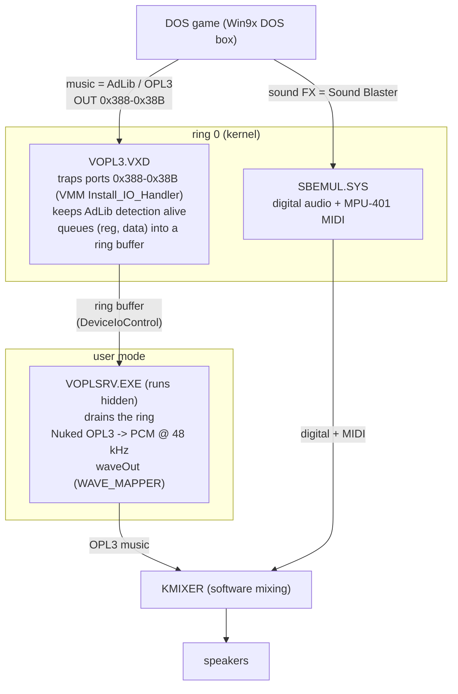

# VOPL3 — Virtual OPL3 FM for Windows 98/ME

*A software AdLib / OPL3 sound chip for Windows 98/ME machines that don't have one.*
A ring-0 port-trap **VxD** captures the OPL register writes a program makes (a DOS
game, typically) and hands them to a user-mode renderer built around **Nuked
OPL3**, which synthesizes the music and plays it through the normal Windows audio
output — all while **coexisting** with Microsoft's SBEMUL so DOS games keep their
digital sound effects and MIDI.

---

Many DOS games produced music through an AdLib-compatible OPL2 or OPL3-style FM
synthesizer found on early ISA sound cards, whether implemented with a genuine
Yamaha chip or compatible hardware. Games controlled it by writing to I/O ports
0x388–0x389, with OPL3-compatible hardware also using 0x38A–0x38B.

Modern machines don't have that chip. A laptop running Windows 98/ME on HD-Audio
(via the WDMHDA driver) has a perfectly good *digital* audio path but **no FM
synthesizer** anywhere. Windows 98 ships **SBEMUL.SYS**, which emulates a Sound
Blaster for DOS boxes — DMA digital audio plus MPU-401 MIDI — but it does **not**
synthesize FM. It only claims port 0x388 to *fake AdLib detection*: a game probes
0x388, sees the expected status bits, decides "AdLib present," and then plays its
music into a void. **Detection passes; the music is silent.**

VOPL3 fills that gap: it makes those OPL register writes actually produce sound again.

## Scope

VOPL3 is for systems whose audio hardware has **no FM synthesizer of its own** and
that rely on **SBEMUL** for DOS Sound Blaster support — the common case on modern
HD-Audio / AC'97 / USB-audio machines. It plays the synthesized OPL3 through the
normal Windows output, so the *output* side works with any sound card; but the
*input* side depends on VOPL3 owning ports **0x388–0x38B**, and VMM's
`Install_IO_Handler` grants a port to a single owner. That trap sits at the VMM
I/O layer, so it also catches raw OPL-port writes from **Win16/Win32** programs in
the System VM, not just DOS boxes (verified).

So if your sound card provides its **own FM synth** you likely don't need this
(unless when using it with a WDM driver AFAIK).

## How it works

Three cooperating pieces, split across the kernel/user boundary:



### 1. `VOPL3.VXD` — the kernel port-trap (ring 0)
A Win9x **static VxD** loaded at boot. Only ring-0 code can trap port I/O this
way, so this is where trapping has to happen. It uses VMM's
`Install_IO_Handler` to hook ports **0x388–0x38B**, and on every access it:
- records the OPL **address/data** register writes and pushes each `(register,
  data)` pair into a small **ring buffer** allocated from the VMM heap;
- emulates just enough OPL **status / timer** behaviour to keep AdLib *detection*
  working, so a game that reaches it isn't confused;
- does **no audio synthesis** — no floating point, no DSP in ring 0.

### 2. `VOPLSRV.EXE` — the user-mode renderer
A hidden Win32 background app. It opens `\\.\VOPL3`, drains the ring buffer via
`DeviceIoControl`, and feeds the register writes into **Nuked OPL3**, a
cycle-accurate OPL3 emulator. The resulting PCM is played through the standard
Windows **`waveOut` (WAVE_MAPPER)** path, where **KMIXER** software-mixes it with
SBEMUL's digital audio — so **no changes to the sound driver are needed** and the
*output* is not tied to any particular card (see **Scope** for the input side).

The renderer ships in **two builds with identical sound output**, chosen at
install time: `VOPLSRV.EXE` uses the reference **Nuked OPL3**, `VOPLFAST.EXE`
uses **Nuked-OPL3-fast** (a bit-exact fork) at roughly **half the CPU cost** —
useful on machines with slower CPUs, where cycle-accurate synthesis is a real
load. Whichever is chosen gets installed as `C:\VOPL3\VOPLSRV.EXE`.

### 3. `SBPATCH.EXE` — the SBEMUL coexistence patch
SBEMUL grabs 0x388 *only* to fake AdLib detection — it produces no FM sound —
and, it **tears down its entire emulation if another driver claims 0x388**.
Just stealing the port kills SBEMUL's digital audio (only FM synth would work),
`SBPATCH.EXE` instead moves SBEMUL's four FM-port table entries (0x388–0x38B)
to (hopefully) unused ports, so SBEMUL keeps its digital audio + MIDI and simply
stops touching 0x388, leaving it for VOPL3. The result: **OPL3 music (VOPL3) and
digital SFX/MIDI (SBEMUL) at the same time.**

The patcher is deliberately careful: it validates the PE checksum before touching
anything, finds the FM-port table by byte pattern (so it works across Win98
builds rather than a hardcoded offset), backs up the original as `SBEMUL.SYS.orig`.

## What's used from other projects

| Component | Origin | License | Role |
|---|---|---|---|
| **Nuked OPL3** (`opl3.c`) | Nuke.YKT | LGPL 2.1 | The actual OPL3 emulator inside the renderer |
| **Nuked-OPL3-fast** | tgies (fork of Nuked OPL3) | LGPL 2.1 | Alternate renderer backend — bit-exact output at ~half the CPU cost |
| **vmdisp9x** VxD glue (`vmm.h`, `io32.h`, `code32.h`) + `fixlink` | JHRobotics | MIT | Building a loadable Win9x VxD with Open Watcom |
| **SBEMUL.SYS** | Microsoft (stock Win98) | — | Patched in place for coexistence; **not** redistributed |
| **Open Watcom** | — | — | Compiler/linker that still targets Win9x (16/32-bit) |

## License

VOPL3's own code — the VxD, the renderer glue, `SBPATCH`, the installer, and the
build scripts — is **MIT** (see [LICENSE](LICENSE)). Bundled third-party parts keep
their own licenses:

- **Nuked OPL3** (`nuked-opl3/`) and **Nuked-OPL3-fast** (`nuked-opl3-fast/`)
  are **LGPL 2.1**. The renderer statically links one of them, so LGPL 2.1 asks
  that a user be able to relink the renderer against a modified copy. That's
  satisfied here: the full source of both cores and their licenses are included,
  and [BUILD.md](BUILD.md) shows how to rebuild `voplsrv.exe` / `voplfast.exe`
  from source.
- **vmdisp9x** glue + `fixlink` (`ref/vmdisp9x/`, and the bundled `vxd/` headers)
  are **MIT**.
- **Microsoft's `SBEMUL.SYS` is not included or redistributed** — `SBPATCH.EXE`
  patches the user's own copy in place.

## Repository layout

```
vxd/         VOPL3.VXD — ring-0 port-trap driver (+ build.ps1, patches wlink output)
renderer/    the user-mode renderer (hidden background app); built twice:
             VOPLSRV.EXE (Nuked OPL3) and VOPLFAST.EXE (Nuked-OPL3-fast)
installer/   INSTALL.BAT / UNINSTALL.BAT, SBPATCH.C (the SBEMUL patcher), README,
             and build.ps1 that assembles the shippable dist/ package
nuked-opl3/  Nuked OPL3 (bundled, LGPL 2.1)
nuked-opl3-fast/  Nuked-OPL3-fast, tgies' bit-exact ~2x-faster fork (LGPL 2.1)
ref/         vmdisp9x fixlink + MIT license (the VxD glue headers vmm.h/io32.h/
             code32.h are bundled into vxd/)
tests/       DOS + host test programs (AdLib/OPL and Sound Blaster probes)
BUILD.md     build prerequisites and step-by-step
```

## Build & install

- **Build:** run the `build.ps1` in `vxd/`, `renderer/`, then `installer/`
  (the last assembles `installer/dist/`, the files you copy to the target).
  `vxd/build.ps1 -Serial` re-enables COM1 debug tracing (off by default).
  Prerequisites (Open Watcom 2.0) and step-by-step are in **[BUILD.md](BUILD.md)**.
- **Install on the Win98/ME machine:** copy the `dist/` folder over and run
  `INSTALL.BAT` from a DOS box — it installs the VxD (boot-loaded), installs the
  renderer (autostarts hidden; you pick the Nuked or the CPU-friendly fast
  build), and patches `SBEMUL.SYS`. Reboot. In your DOS
  game set **Music = AdLib/OPL3** and **Sound FX = Sound Blaster**. `UNINSTALL.BAT`
  restores the original SBEMUL and removes VOPL3.

## Status

Working end-to-end on real hardware — e.g. DOOM's OPL3 music plays correctly while
its Sound Blaster digital effects continue through SBEMUL, at the same time.
