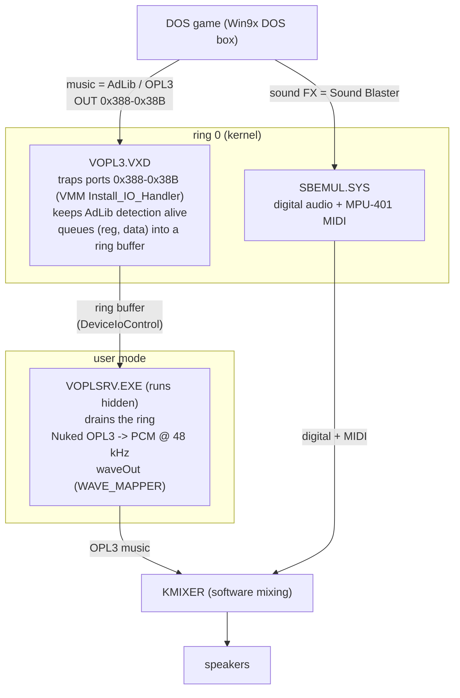

# VOPL3 — Virtual OPL3 FM for Windows 98/ME

*A software AdLib / OPL3 sound chip for Windows 98/ME machines that don't have one.*
A ring-0 port-trap **VxD** captures the OPL register writes a program makes (a DOS
game, typically) and hands them to a user-mode renderer built around **Nuked
OPL3**, which synthesizes the music and plays it through the normal Windows audio
output — all while **coexisting** with Microsoft's SBEMUL so DOS games keep their
digital sound effects and MIDI.

---

## The problem

DOS games make music on the **OPL2/OPL3 FM synthesizer** — the "AdLib" chip built
into every Sound Blaster — by writing registers to I/O ports **0x388–0x38B**.
On the hardware of the era those writes reached a real Yamaha chip.

Modern machines don't have that chip. A laptop running Windows 98/ME on HD-Audio
(via the WDMHDA driver) has a perfectly good *digital* audio path but **no FM
synthesizer** anywhere. Windows 98 ships **SBEMUL.SYS**, which emulates a Sound
Blaster for DOS boxes — DMA digital audio plus MPU-401 MIDI — but it does **not**
synthesize FM. It only claims port 0x388 to *fake AdLib detection*: a game probes
0x388, sees the expected status bits, decides "AdLib present," and then plays its
music into a void. **Detection passes; the music is silent.**

VOPL3 fills exactly that gap: it makes those OPL register writes actually produce
sound again.

## Scope — when it applies

VOPL3 is for systems whose audio hardware has **no FM synthesizer of its own** and
that rely on **SBEMUL** for DOS Sound Blaster support — the common case on modern
HD-Audio / AC'97 / USB-audio machines. It plays the synthesized OPL3 through the
normal Windows output, so the *output* side works with any sound card; but the
*input* side depends on VOPL3 owning ports **0x388–0x38B**, and VMM's
`Install_IO_Handler` grants a port to a single owner. That trap sits at the VMM
I/O layer, so it also catches raw OPL-port writes from **Win16/Win32** programs in
the System VM, not just DOS boxes (verified).

So if your sound card provides its **own hardware OPL3/FM** — for example some
**Yamaha YMF7xx (DS-1)** cards — DOS FM already works through the card, its driver
typically already owns 0x388–0x38B, and you **don't need VOPL3** (installing it
alongside such a driver would just contend for the same ports). VOPL3 is the
answer when the FM is missing, not when it's already there.

## How it works

Three cooperating pieces, split across the kernel/user boundary:



### 1. `VOPL3.VXD` — the kernel port-trap (ring 0)
A Win9x **static VxD** loaded at boot. Only ring-0 code can trap port I/O this
way, so this is where trapping has to happen. It uses VMM's
`Install_IO_Handler` to hook ports **0x388–0x38B**, and on every access it:
- records the OPL **address/data** register writes and pushes each `(register,
  data)` pair into a small **ring buffer** allocated from the VMM heap;
- emulates just enough OPL **status / timer** behaviour to keep AdLib *detection*
  working, so a game that reaches it isn't confused;
- does **no audio synthesis** — no floating point, no DSP in ring 0.

### 2. `VOPLSRV.EXE` — the user-mode renderer
A hidden Win32 background app. It opens `\\.\VOPL3`, drains the ring buffer via
`DeviceIoControl`, and feeds the register writes into **Nuked OPL3**, a
cycle-accurate OPL3 emulator. The resulting PCM is played through the standard
Windows **`waveOut` (WAVE_MAPPER)** path, where **KMIXER** software-mixes it with
SBEMUL's digital audio — so **no changes to the sound driver are needed** and the
*output* is not tied to any particular card (see **Scope** for the input side).

### 3. `SBPATCH.EXE` — the SBEMUL coexistence patch
See "Why patch SBEMUL" below. Run once at install time; it edits the user's own
`SBEMUL.SYS` so it stops fighting VOPL3 over port 0x388.

## Why it's built this way

**Kernel trap + user-mode render (the split).** Port trapping *requires* a VxD
(ring 0). But accurate OPL3 emulation is heavy floating-point DSP, and playback
wants `waveOut`/KMIXER — neither of which belongs in a ring-0 VxD. So the design
splits along the natural line: the VxD does the one thing only the kernel can
(catch the writes) and nothing else; the renderer does the heavy lifting in user
mode where it's safe and where the audio stack lives. A lock-free **ring buffer**
decouples the realtime producer (the I/O trap) from the consumer (the renderer).

**Why patch SBEMUL instead of just taking port 0x388.** SBEMUL grabs 0x388 *only*
to fake AdLib detection — it produces no FM sound — and, critically, it **tears
down its entire emulation if another driver claims 0x388**. So just stealing the
port kills SBEMUL's digital audio too, and you'd be back to "music OR sound
effects, never both." `SBPATCH.EXE` instead moves SBEMUL's four FM-port table
entries (0x388–0x38B) to (hopefully) unused ports, so SBEMUL keeps its digital
audio + MIDI and simply stops touching 0x388, leaving it for VOPL3. The result:
**OPL3 music (VOPL3) and digital SFX/MIDI (SBEMUL) at the same time.**
(Reverse-engineering confirmed SBEMUL has no OPL synthesizer and no hidden way 
to feed FM to another driver, so patching it out of 0x388 is the clean answer.)

The patcher is deliberately careful: it validates the PE checksum before touching
anything, finds the FM-port table **by byte pattern** (so it works across Win98
builds rather than a hardcoded offset), backs up the original as
`SBEMUL.SYS.orig`, and **never redistributes Microsoft's binary** —
it patches your own file in place and recomputes the checksum.

**Fighting the Win98 scheduler (the choppiness fix).** On a single-CPU Win9x
machine a CPU-bound DOS game (DOOM) starves the user-mode renderer, which made the
music stutter even though the game ran fine. The renderer counters this with
`timeBeginPeriod(1)`, `REALTIME_PRIORITY_CLASS` + a time-critical thread, and a
deep (~160 ms) `waveOut` buffer refilled off a **`CALLBACK_EVENT`** — so it sleeps
until a buffer frees, then briefly preempts the game to refill. Latency on music
is inaudible; the stutter is gone.

## What's used from other projects

| Component | Origin | License | Role |
|---|---|---|---|
| **Nuked OPL3** (`opl3.c`) | Nuke.YKT | LGPL 2.1 | The actual OPL3 emulator inside the renderer |
| **vmdisp9x** VxD glue (`vmm.h`, `io32.h`, `code32.h`) + `fixlink` | JHRobotics | MIT | Building a loadable Win9x VxD with Open Watcom |
| **SBEMUL.SYS** | Microsoft (stock Win98) | — | Patched in place for coexistence; **not** redistributed |
| **Open Watcom** | — | — | Compiler/linker that still targets Win9x (16/32-bit) |

## License

VOPL3's own code — the VxD, the renderer glue, `SBPATCH`, the installer, and the
build scripts — is **MIT** (see [LICENSE](LICENSE)). Bundled third-party parts keep
their own licenses:

- **Nuked OPL3** (`nuked-opl3/`) is **LGPL 2.1**. The renderer statically links it,
  so LGPL 2.1 asks that a user be able to relink the renderer against a modified
  Nuked OPL3. That's satisfied here: the full Nuked OPL3 source and its license are
  included, and [BUILD.md](BUILD.md) shows how to rebuild `voplsrv.exe` from source.
  Keep `nuked-opl3/` (source + `LICENSE`) with any binary you distribute.
- **vmdisp9x** glue + `fixlink` (`ref/vmdisp9x/`, and the bundled `vxd/` headers)
  are **MIT**.
- **Microsoft's `SBEMUL.SYS` is not included or redistributed** — `SBPATCH.EXE`
  patches the user's own copy in place.

### A note on the VxD toolchain
Open Watcom's `wlink` emits an LE/VXD header that Windows 9x will **load but
silently never run**, for two reasons this project had to patch out after linking:
1. the *ModuleFlags* "no internal fixups" bit is set even though the image *has* a
   fixup section, so the loader skips relocations and the DDB's control-proc
   pointer is left at its unrelocated address; and
2. the DDB ordinal is exported as a 286 **call gate** instead of a 32-bit entry,
   so VMM resolves a bogus DDB.

`vxd/build.ps1` fixes both in the binary after linking. (There's also a
zero-fill quirk: BSS isn't reliably mapped at runtime, so all mutable VxD state
lives in one initialized struct forced into `_DATA`.) These were the difference
between "loads but does nothing" and a working driver.

## Repository layout

```
vxd/         VOPL3.VXD — ring-0 port-trap driver (+ build.ps1, patches wlink output)
renderer/    VOPLSRV.EXE — user-mode Nuked-OPL3 renderer (hidden background app)
installer/   INSTALL.BAT / UNINSTALL.BAT, SBPATCH.C (the SBEMUL patcher), README,
             and build.ps1 that assembles the shippable dist/ package
nuked-opl3/  Nuked OPL3 (bundled, LGPL 2.1)
ref/         vmdisp9x fixlink + MIT license (the VxD glue headers vmm.h/io32.h/
             code32.h are bundled into vxd/)
tests/       DOS + host test programs (AdLib/OPL and Sound Blaster probes)
BUILD.md     build prerequisites and step-by-step
```

## Build & install

- **Build:** run the `build.ps1` in `vxd/`, `renderer/`, then `installer/`
  (the last assembles `installer/dist/`, the files you copy to the target).
  `vxd/build.ps1 -Serial` re-enables COM1 debug tracing (off by default).
  Prerequisites (Open Watcom 2.0) and step-by-step are in **[BUILD.md](BUILD.md)**.
- **Install on the Win98/ME machine:** copy the `dist/` folder over and run
  `INSTALL.BAT` from a DOS box — it installs the VxD (boot-loaded), installs the
  renderer (autostarts hidden), and patches `SBEMUL.SYS`. Reboot. In your DOS
  game set **Music = AdLib/OPL3** and **Sound FX = Sound Blaster**. `UNINSTALL.BAT`
  restores the original SBEMUL and removes VOPL3.

## Status

Working end-to-end on real hardware — e.g. DOOM's OPL3 music plays correctly while
its Sound Blaster digital effects continue through SBEMUL, at the same time.
