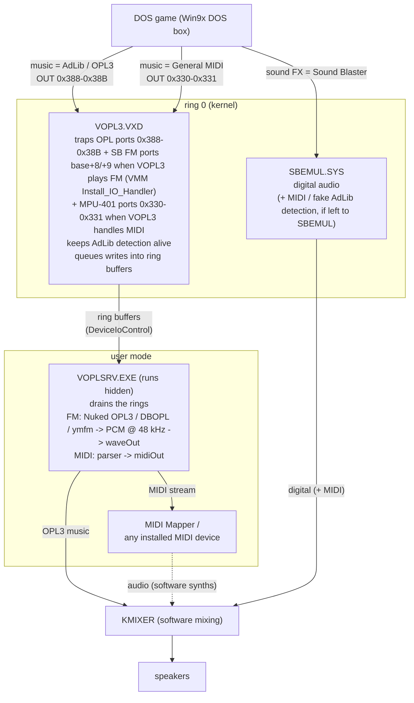

# VOPL3 — Virtual OPL3 FM for Windows 98/ME

*A software AdLib / OPL3 sound chip for Windows 98/ME machines that don't have one.*
A ring-0 port-trap **VxD** captures the OPL register writes a program makes (a DOS
game, typically) and hands them to a user-mode renderer built around **Nuked
OPL3** (or, as alternatives, DOSBox's DBOPL or ymfm), which synthesizes the music and plays it through the normal Windows audio
output — all while **coexisting** with Microsoft's SBEMUL so DOS games keep their
digital sound effects (and MIDI). It can *optionally* also take over DOS-game
**MPU-401 MIDI** and route it to any synth you choose (see **MIDI** below).

---

Many DOS games produced music through an AdLib-compatible OPL2 or OPL3-style FM
synthesizer found on early ISA sound cards, whether implemented with a genuine
Yamaha chip or compatible hardware. Games controlled it by writing to I/O ports
0x388–0x389, with OPL3-compatible hardware also using 0x38A–0x38B.

Modern machines don't have that chip. A laptop running Windows 98/ME on HD-Audio
(via the WDMHDA driver) has a perfectly good *digital* audio path but **no FM
synthesizer** anywhere. Windows 98 ships **SBEMUL.SYS**, which emulates a Sound
Blaster for DOS boxes — DMA digital audio plus MPU-401 MIDI — but it does **not**
synthesize FM. It only claims port 0x388 to *fake AdLib detection*: a game probes
0x388, sees the expected status bits, decides "AdLib present," and then plays its
music into a void. **Detection passes; the music is silent.**

VOPL3 fills that gap: it makes those OPL register writes actually produce sound again.

## Scope

VOPL3 is for systems whose audio hardware has **no FM synthesizer of its own** and
that rely on **SBEMUL** for DOS Sound Blaster support — the common case on modern
HD-Audio / AC'97 / USB-audio machines. It plays the synthesized OPL3 through the
normal Windows output, so the *output* side works with any sound card; but the
*input* side depends on VOPL3 owning the FM ports (**0x388–0x38B**, and the
Sound Blaster's 0x2x8/0x2x9 — base+8/+9, see below), and VMM's
`Install_IO_Handler` grants a port to a single owner. That trap sits at the VMM
I/O layer, so it also catches raw OPL-port writes from **Win16/Win32** programs in
the System VM, not just DOS boxes (verified).

So if your sound card provides its **own FM synth** you likely don't need this
(unless when using it with a WDM driver AFAIK). If you still want VOPL3's MIDI
routing on such a machine, choose to leave the FM ports **free** at install (see
**Install choices** below).

## How it works

Three cooperating pieces, split across the kernel/user boundary:


```mermaid
flowchart TD
    G["DOS game (Win9x DOS box)"]

    subgraph k["ring 0 (kernel)"]
        VXD["VOPL3.VXD<br/>traps OPL ports 0x388-0x38B + SB FM ports base+8/+9 when VOPL3 plays FM (VMM Install_IO_Handler)<br/>+ MPU-401 ports 0x330-0x331 when VOPL3 handles MIDI<br/>keeps AdLib detection alive<br/>queues writes into ring buffers"]
        SB["SBEMUL.SYS<br/>digital audio<br/>(+ MIDI / fake AdLib detection, if left to SBEMUL)"]
    end

    subgraph u["user mode"]
        SRV["VOPLSRV.EXE (runs hidden)<br/>drains the rings<br/>FM: Nuked OPL3 / DBOPL / ymfm -> PCM @ 48 kHz -> waveOut<br/>MIDI: parser -> midiOut"]
        SYN["MIDI Mapper /<br/>any installed MIDI device"]
    end

    G -- "music = AdLib / OPL3<br/>OUT 0x388-0x38B" --> VXD
    G -- "music = General MIDI<br/>OUT 0x330-0x331" --> VXD
    G -- "sound FX = Sound Blaster" --> SB
    VXD -- "ring buffers<br/>(DeviceIoControl)" --> SRV
    SRV -- "OPL3 music" --> KMIX["KMIXER (software mixing)"]
    SRV -- "MIDI stream" --> SYN
    SYN -. "audio (software synths)" .-> KMIX
    SB -- "digital (+ MIDI)" --> KMIX
    KMIX --> SPK["speakers"]
```

### 1. `VOPL3.VXD` — the kernel port-trap (ring 0)
A Win9x **static VxD** loaded at boot. Only ring-0 code can trap port I/O this
way, so this is where trapping has to happen. It uses VMM's
`Install_IO_Handler` to hook ports **0x388–0x38B** and the Sound Blaster's FM
ports at base+8/+9 (when VOPL3 plays FM — hooked when the renderer asks at
startup, not at boot), and on every access it:
- records the OPL **address/data** register writes and pushes each `(register,
  data)` pair into a small **ring buffer** allocated from the VMM heap;
- emulates just enough OPL **status / timer** behaviour to keep AdLib *detection*
  working, so a game that reaches it isn't confused;
- does **no audio synthesis** — no floating point, no DSP in ring 0.

### 2. `VOPLSRV.EXE` — the user-mode renderer
A hidden Win32 background app. It opens `\\.\VOPL3`, drains the ring buffer via
`DeviceIoControl`, and feeds the register writes into **Nuked OPL3**, a
cycle-accurate OPL3 emulator. The resulting PCM is played through the standard
Windows **`waveOut` (WAVE_MAPPER)** path, where **KMIXER** software-mixes it with
SBEMUL's digital audio — so **no changes to the sound driver are needed** and the
*output* is not tied to any particular card (see **Scope** for the input side).

The renderer ships in **four builds**, all installed: `VOPLSRV.EXE`
uses the reference **Nuked OPL3**, `VOPLFAST.EXE` uses **Nuked-OPL3-fast** (a
bit-exact fork) at roughly **half the CPU cost** — useful on machines with
slower CPUs, where cycle-accurate synthesis is a real load — and `VOPLDB.EXE`
uses **DOSBox's DBOPL**, which needs only a small fraction of the CPU of either
Nuked build but is less accurate (it computes directly at the output rate, and
only for the voices that are sounding), and `VOPLYM.EXE` uses **ymfm**, the
OPL3 emulator from MAME, at about the CPU cost of Nuked-OPL3-fast.
The installer asks which one to start with; the **control panel** switches
between them at any time (see below).

**Slower CPUs and games timed on the VGA retrace.** Some DOS games time their
frames by polling the VGA for the vertical retrace, and some of those also
step their music once per frame. The renderer runs at realtime priority, and
whenever it holds the CPU at the moment of that short pulse, the game misses
it and waits a whole extra frame: the game slows down (and its music with it,
where the music is stepped per frame), by roughly the share of CPU time the
renderer takes. On a fast CPU that share is too small to notice; on a slow
one, choose the DBOPL build for such games — it takes several times less CPU
than the others. Games that time themselves off the timer interrupt (e.g.
Doom, Duke Nukem 3D) are not affected. None of this is particular to VOPL3:
any background program taking a few percent of a slow CPU at a high priority
slows such a game the same way (measured with an unrelated load generator).

FM volume is adjustable from the **control panel** (applies live — see
below) or in `C:\VOPL3\VOPL3.INI` (`volume=<percent>`, default **200**, max
400). 100 is the OPL3 chip's authentic digital level — which sounds quiet next
to SBEMUL's digital SFX. The boost is applied after synthesis, so the emulator
cores stay bit-exact.

### 3. SBEMUL coexistence: `SoftFM` and `SBPATCH.EXE`
SBEMUL grabs its FM ports *only* to fake AdLib detection — it produces no FM
sound. These are the AdLib ports 0x388–0x38B and the Sound Blaster's own FM
ports at base+8/+9, where *base* is the Sound Blaster's I/O address (the `A`
value in `BLASTER`, normally 0x220, so 0x228/0x229). And it **tears down its
entire emulation if another driver claims 0x388** (or its MIDI ports). Just
stealing the ports would kill SBEMUL's digital audio, so the installer steers
SBEMUL away from them instead:

- **FM:** SBEMUL's own registry value `SoftFM`
  (`HKLM\Software\Microsoft\Multimedia\WDMAudio\SBEmulator`). With
  `SoftFM=1`, SBEMUL leaves the AdLib ports 0x388–0x38B **and** the Sound
  Blaster's FM ports at base+8/+9 (e.g. 0x228/0x229) alone, and keeps its
  digital audio. `INSTALL.BAT` sets it when FM is VOPL3 or left free, and
  removes it when FM stays with SBEMUL. With FM = VOPL3, VOPL3 then traps
  both groups, as a real Sound Blaster answers with the same chip at both:
  base+8/+9 for every SB base (0x220/0x240/0x260/0x280), so the VxD needs no
  base setting. That covers games that look for the FM chip at base+8 first
  (e.g. the DiamondWare Sound ToolKit) or use only that address.
- **MIDI:** `SBPATCH.EXE` moves SBEMUL's MPU-401 port-table entries
  (0x330/0x331) to unused ports inside the user's own `SBEMUL.SYS`, so SBEMUL
  keeps its digital audio and stops touching them, leaving them for VOPL3.
- `SoftFM` is known to work on SBEMUL 4.10.2222 (98SE) and 4.10.2223 (the
  Q269601 hotfix). On any other build `SBPATCH.EXE` also moves the FM
  port-table entries (0x388–0x38B), as a fallback in case that build doesn't
  read `SoftFM`.

The result: **OPL3 music or routable MIDI (VOPL3) and digital SFX (SBEMUL) at
the same time.** Reinstalling with different choices gives ports back to
SBEMUL as needed (including FM tables moved by earlier VOPL3 versions, where
`SoftFM` now does the job).

## Install choices: who handles which ports

`INSTALL.BAT` asks two independent questions:

| | **VOPL3** (recommended) | **Left free** | **SBEMUL** (stock) |
|---|---|---|---|
| **FM** — ports 0x388–0x38B, 0x2x8/0x2x9 | SBEMUL is steered away from these ports; VOPL3 traps them and synthesizes the music | SBEMUL is steered away from these ports, and VOPL3 doesn't trap them either — they are free for anything else that uses them | games detect an AdLib, but AdLib music is silent |
| **MIDI** — ports 0x330/0x331 | SBEMUL is steered away from these ports; VOPL3 sends DOS-game MIDI to any device (see **MIDI** below) | — | MIDI plays on the Microsoft GS Wavetable synth |

Leaving both to SBEMUL isn't offered, since VOPL3 would have nothing to do. When
VOPL3 doesn't play FM, the renderer opens no audio stream at all. The choices are
stored in the registry (`HKLM\Software\VOPL3`: `Fm` = 1 VOPL3, 2 left free,
0 SBEMUL; `Midi` = 1 VOPL3, 0 SBEMUL); to change them, run `INSTALL.BAT` again.

`SBPATCH.EXE` is deliberately careful: it finds each port table by byte pattern,
required to match exactly once (so it works across Win98 builds rather than a
hardcoded offset, and refuses anything unrecognisable), backs up the original as
`SBEMUL.SYS.orig`, and writes back a correct PE checksum. A stale checksum on the
input only warns — third-party SBEMUL patches (e.g. the SB16-enable patch) skip
the checksum fixup, and coexisting with them is supported.

## MIDI: routable DOS-game General MIDI

Without VOPL3, DOS-game MIDI plays through SBEMUL's fixed target, the **Microsoft
GS Wavetable** software synth. When VOPL3 handles MIDI (the recommended install
choice), it takes over the MPU-401:

- The VxD traps the **MPU-401 ports 0x330/0x331** (UART mode) and captures the
  game's raw MIDI byte stream; the renderer re-emits it with `midiOut` to the
  **Windows MIDI Mapper** (or a specific device). So the music can go to **any
  installed synth or MIDI device** — a software synth (Roland VSC, Yamaha
  S‑YXG50, …), a hardware wavetable, or an external module on a MIDI interface
  — instead of only the GS synth. (SBEMUL's kernel MIDI is hardwired to that
  one synth; this is the way around it.)
- Pick the target in the **VOPL3 control panel** (easiest — applies live, see
  below), in **Control Panel → Multimedia → MIDI**, or set it directly
  in `C:\VOPL3\VOPL3.INI` `[midi] device=` (`65535` = MIDI Mapper, the default;
  or a device index). Run **`MIDILIST.EXE`** to list the devices and their
  indices.
- VOPL3 then *replaces* SBEMUL's MIDI (SBPATCH frees 0x330/0x331). The default
  target is the MIDI Mapper — normally the same GS synth SBEMUL would use — so
  nothing changes until you pick another device. Scope is **UART mode**;
  MPU-401 intelligent mode is not emulated.

## Control panel (`VOPLCFG.EXE`)

An optional Win32 **system-tray app** installed alongside the renderer:

- **MIDI output device** and **FM volume**, applied **live** — Apply writes
  `C:\VOPL3\VOPL3.INI` (so everything works identically with no GUI running)
  and pokes the running renderer to re-read it; no reboot, no restart.
- **Sound output device** for the FM, also applied **live** (the renderer
  reopens the output on the chosen card). This is the FM's own output, so on
  a machine with more than one card it can play on a different one than
  Windows uses by default; where DOS MIDI goes is a separate choice (see
  above). It is stored by name, not by index, so it survives cards being
  added or removed; a card that is no longer installed falls back to the
  Windows default instead of leaving the FM silent.
- **OPL3 emulator**: pick one of the four builds and Apply — the renderer is
  restarted as that build (and becomes the one that starts with Windows); no
  reboot. The new renderer starts with a fresh chip, so a game playing FM
  music at that moment loses the instruments it had loaded — its music may
  stay silent or sound wrong until it loads new ones. Switch between games,
  or restart the music.
- **Status at a glance**: renderer running/backend, FM playing/idle, dynamic
  priority, MIDI bridge + synth state, and the driver/renderer revisions.
- **Debug counters** (the same ones `VOPLSTAT.EXE` prints): OPL ring
  head/tail/lost, trapped writes, MIDI bytes captured/lost — overruns are
  flagged inline.

It talks to the VxD read-only and to a small status block the renderer
publishes, and degrades gracefully — with no driver it shows *not loaded*,
with no renderer *not running*; settings still save. Minimize hides it to the
tray; X exits. `INSTALL.BAT` asks whether it should start with Windows
(minimized to the tray).

## What's used from other projects

| Component | Origin | License | Role |
|---|---|---|---|
| **Nuked OPL3** (`opl3.c`) | Nuke.YKT | LGPL 2.1 | The actual OPL3 emulator inside the renderer |
| **Nuked-OPL3-fast** | tgies (fork of Nuked OPL3) | LGPL 2.1 | Alternate renderer backend — bit-exact output at ~half the CPU cost |
| **DBOPL** (`dbopl.cpp`) | The DOSBox Team (DOSBox SVN r4494) | GPL v2 or later | Third renderer backend — far less CPU, less accurate |
| **ymfm** (`ymfm_opl.cpp`) | Aaron Giles (MAME's FM cores) | BSD 3-clause | Fourth renderer backend — about the CPU cost of Nuked-OPL3-fast |
| **vmdisp9x** VxD glue (`vmm.h`, `io32.h`, `code32.h`) + `fixlink` | JHRobotics | MIT | Building a loadable Win9x VxD with Open Watcom |
| **SBEMUL.SYS** | Microsoft (stock Win98) | — | Patched in place for coexistence; **not** redistributed |
| **Open Watcom** | — | — | Compiler/linker that still targets Win9x (16/32-bit) |
| **GCC** (32-bit MinGW, e.g. MSYS2's mingw32) | — | — | Compiles the emulator cores only (~2x faster code than Watcom's); linked by Watcom |

## License

VOPL3's own code — the VxD, the renderer glue, `SBPATCH`, the installer, and the
build scripts — is **MIT** (see [LICENSE](LICENSE)). Bundled third-party parts keep
their own licenses:

- **Nuked OPL3** (`nuked-opl3/`) and **Nuked-OPL3-fast** (`nuked-opl3-fast/`)
  are **LGPL 2.1**. The renderer statically links one of them, so LGPL 2.1 asks
  that a user be able to relink the renderer against a modified copy. That's
  satisfied here: the full source of both cores and their licenses are included,
  and [BUILD.md](BUILD.md) shows how to rebuild `voplsrv.exe` / `voplfast.exe`
  from source.
- **DBOPL** (`dbopl/`), DOSBox's OPL emulator, is **GPL v2 or later**. The
  renderer build that contains it, `vopldb.exe` / `VOPLDB.EXE`, is therefore
  distributed under the GPL as a whole; its license text ships alongside it as
  `DBOPL-LICENSE.txt`, and its complete source is this repository. VOPL3's other
  programs and its own source files are unaffected and stay MIT. See
  [dbopl/README.md](dbopl/README.md) for the exact origin and the small Open
  Watcom patch applied to it.
- **ymfm** (`ymfm/`) is **BSD 3-clause**; its license text ships alongside
  `VOPLYM.EXE` as `YMFM-LICENSE.txt`. See [ymfm/README.md](ymfm/README.md) for
  the exact origin and the Open Watcom patch applied to it.
- **vmdisp9x** glue + `fixlink` (`ref/vmdisp9x/`, and the bundled `vxd/` headers)
  are **MIT**.
- **Microsoft's `SBEMUL.SYS` is not included or redistributed** — `SBPATCH.EXE`
  patches the user's own copy in place.

## Repository layout

```
vxd/         VOPL3.VXD — ring-0 port-trap driver (+ build.ps1, patches wlink output)
renderer/    the user-mode renderer (hidden background app); built four times:
             VOPLSRV.EXE (Nuked OPL3), VOPLFAST.EXE (Nuked-OPL3-fast),
             VOPLDB.EXE (DOSBox DBOPL) and VOPLYM.EXE (ymfm);
             vopl3ipc.h is the status/control contract shared with the GUI
gui/         VOPLCFG.EXE — the control panel / tray app (see above)
installer/   INSTALL.BAT / UNINSTALL.BAT, SBPATCH.C (the SBEMUL patcher),
             VOPLSTOP.C (stops running VOPL3 programs on reinstall), *.REG
             (incl. MIDION.REG, FMSBEMUL.REG and FMFREE.REG for the install
             choices, VOPLCFG.REG for GUI autostart),
             README, and build.ps1 that assembles the shippable dist/ package
nuked-opl3/  Nuked OPL3 (bundled, LGPL 2.1)
nuked-opl3-fast/  Nuked-OPL3-fast, tgies' bit-exact ~2x-faster fork (LGPL 2.1)
dbopl/       DOSBox's DBOPL (GPL v2+) + its Open Watcom patch and C glue
ymfm/        ymfm's OPL3 (BSD 3-clause) + its Open Watcom patch and C glue
ref/         vmdisp9x fixlink + MIT license (the VxD glue headers vmm.h/io32.h/
             code32.h are bundled into vxd/)
tests/       DOS + host test programs (AdLib/OPL and Sound Blaster probes;
             MIDILIST.C lists MIDI output devices for VOPL3's MIDI)
BUILD.md     build prerequisites and step-by-step
```

## Build & install

- **Build:** run the `build.ps1` in `vxd/`, `renderer/`, `gui/`, then
  `installer/` (the last assembles `installer/dist/`, the files you copy to the
  target). `vxd/build.ps1 -Serial` re-enables COM1 debug tracing (off by default).
  Prerequisites (Open Watcom 2.0, plus a 32-bit MinGW GCC for the emulator
  cores) and step-by-step are in **[BUILD.md](BUILD.md)**.
- **Install on the Win98/ME machine:** copy the `dist/` folder over and run
  `INSTALL.BAT` from a DOS box — it installs the VxD (boot-loaded), installs the
  renderer (all four builds; autostarts hidden, you pick which), installs the
  control panel (you choose whether it starts with
  Windows), asks who handles the FM and the MIDI ports (see **Install
  choices** above), and sets up SBEMUL accordingly (`SoftFM`, `SBEMUL.SYS`
  patch). Reboot. In your DOS
  game set **Music = AdLib/OPL3** or **General MIDI** and **Sound FX = Sound
  Blaster**. `UNINSTALL.BAT` restores the original SBEMUL and removes VOPL3;
  a copy of it is installed to `C:\VOPL3`, so removing VOPL3 later does not
  need the package.

## Status

Working end-to-end on real hardware — e.g. DOOM's OPL3 music plays correctly while
its Sound Blaster digital effects continue through SBEMUL, at the same time.
